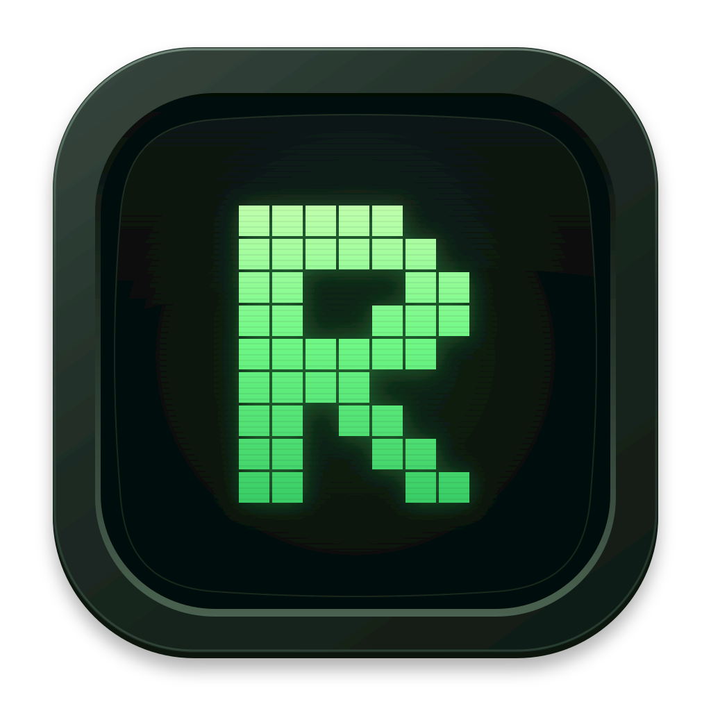

# Rune

Your terminal, with the context you need.

Rune is a minimal native macOS workspace for terminal-first development. Keep
your shell at the center, with files, diffs, and Git history close at hand.

- **Stay in your flow.** A Ghostty-powered terminal alongside your project files.
- **See what changed.** Browse diffs and Git history without leaving your workspace.
- **Understand the change.** Get explanations, diagrams, and links to the code with Change Brief.
- **Keep your hands on the keyboard.** Find files, run commands, and switch branches or projects through searchable palettes.
- **Pick up where you left off.** Rune remembers your last project, window layout, and expanded folders.

Built for macOS 26 and newer. Small, focused, and native.

## Change Brief

Get a clear explanation of your changes, with diagrams and links to the code.
Open **Change Brief** from the Git sidebar or **⌘⇧P**, then choose your working
tree, staged changes, or PR.

Uses your installed Codex or Claude Code. Sign in first and choose your preferred
agent in **Settings → Change Brief**. Briefs are saved so you can pick up where
you left off; refresh when your changes evolve.

## Credits

Powered by [Ghostty](https://ghostty.org/). File icons from the
[Colored Zed Icons Theme](https://github.com/TheRedXD/zed-icons-colored-theme),
vendored at [af356cf](https://github.com/TheRedXD/zed-icons-colored-theme/tree/af356cf3d9546928a272a05a08a9aa0dd4b6556e)
with their original license notice included in the app bundle.

Native diagrams use [BeautifulMermaid](https://github.com/lukilabs/beautiful-mermaid-swift)
under the MIT license and its [elk-swift](https://github.com/lukilabs/elk-swift)
layout dependency under the Eclipse Public License 2.0. The unmodified elk-swift
1.0.2 source is available at its [tagged source repository](https://github.com/lukilabs/elk-swift/tree/1.0.2).
License texts and source links are included in the app’s resources.
