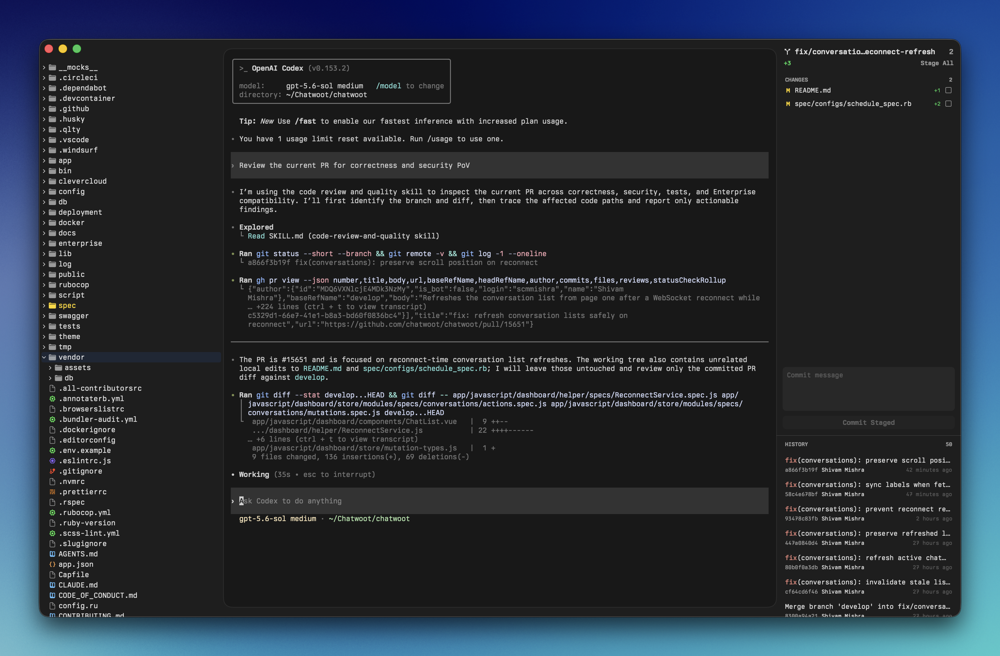

# Rune

Rune is a minimal native macOS workspace for terminal-first development.



It combines a file tree, an embedded Ghostty terminal, lightweight file and diff previews, and Git changes and history in one window.

## Install

Requirements:

- macOS 26 or newer
- Xcode 26 or newer

Build and install Rune in `/Applications`:

```sh
mise run relaunch
```

Add the CLI to your path:

```sh
ln -s "$(pwd)/bin/rune" ~/.local/bin/rune
```

## Use

```sh
rune                  # Open the current directory
rune path/to/project  # Open another project
```

Press `Command+P` to find a file and `Command+,` to adjust Rune's font family and size.

Press `Command+Shift+O` to search recent projects, or `Command+Shift+B` to
search local branches and switch or create a branch from the current HEAD.
Git reports any local changes that prevent switching without discarding them.

Previews have a Find button (`Command+F`). Diff previews show the selected file's
position and highlight it in the Git sidebar. Use Up/Down to move between files
when the text editor is not focused, and `Option+Command+Up/Down` to jump between
hunks. The hunk buttons work while the editor is focused too.

Rune reopens the most recent project when launched without a folder. Each project
remembers its window frame, expanded folders, and sidebar widths. Drag the thin
edges beside the terminal to resize the sidebars.

For an incremental development loop, run `mise run dev`.

## Credits

Rune's colored file icons use selected light and dark assets from the
[Colored Zed Icons Theme](https://github.com/TheRedXD/zed-icons-colored-theme).
The assets are vendored from
[revision af356cf](https://github.com/TheRedXD/zed-icons-colored-theme/tree/af356cf3d9546928a272a05a08a9aa0dd4b6556e)
and retain their original license notice in the app bundle.
